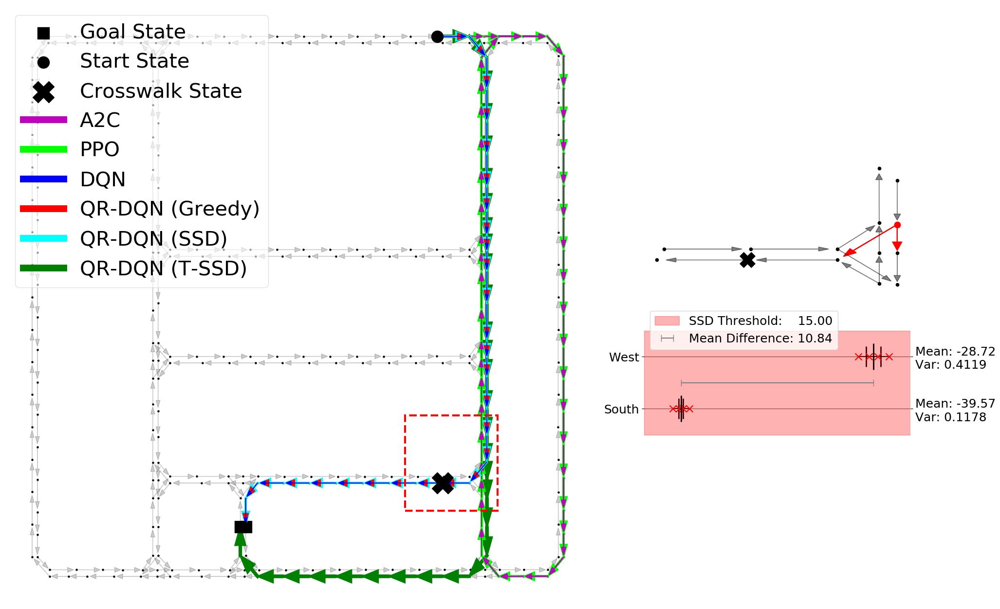

# Distributional RL for Route Planning

This repository provides the codes of our UR 2023 paper [here](https://arxiv.org/abs/2304.09996). We developed the Stochastic Road Network Environment based on the autonomous vehicle simulator [CARLA](https://github.com/carla-simulator/carla), and proposed a Distributional RL based route planner that can plan the shortest routes that minimize stochasticity in travel time.

<p align="center">
 
</p>

Please cite as:
```
@INPROCEEDINGS{10202222,
  author={Lin, Xi and Szenher, Paul and Martin, John D. and Englot, Brendan},
  booktitle={2023 20th International Conference on Ubiquitous Robots (UR)}, 
  title={Robust Route Planning with Distributional Reinforcement Learning in a Stochastic Road Network Environment}, 
  year={2023},
  volume={},
  number={},
  pages={287-294},
  doi={10.1109/UR57808.2023.10202222}}
```

## The Stochastic Road Network Environment

The Stochastic Road Network Environment is built upon map structure and simulated sensor data originating from CARLA version 0.9.6. Five such maps are available by default, named in the sequencing of Town01 to Town05. The graph topology structure of Town01 and an example observation provided to the learning system are shown as follows. For detailed information about the Stochastic Road Network Environment, please refer to our paper.

<p align="center">
 
</p>

## Map Data Generation

The map data needed to run experiments on Town01 to Town05 could be downloaded from [here](https://stevens0-my.sharepoint.com/:f:/g/personal/xlin26_stevens_edu/EioIeHjcj_xNnJJc7ziMAUMBmz6fLFFxblYV2JWNHvAcyQ?e=R1UAjR), or you could go through the following process to generate data with the provided scripts.

1. Install [NVIDIA Container Runtime](https://nvidia.github.io/nvidia-container-runtime/)
```
curl -s -L https://nvidia.github.io/nvidia-container-runtime/gpgkey | \
  sudo apt-key add -
distribution=$(. /etc/os-release;echo $ID$VERSION_ID)
curl -s -L https://nvidia.github.io/nvidia-container-runtime/$distribution/nvidia-container-runtime.list | \
  sudo tee /etc/apt/sources.list.d/nvidia-container-runtime.list
sudo apt-get update
sudo apt install nvidia-container-runtime

sudo systemctl daemon-reload
sudo systemctl restart docker
```

2. Clone this git repo and enter the directory.
```
git clone git@github.com:RobustFieldAutonomyLab/Stochastic_Road_Network.git
cd Stochastic_Road_Network
```

3. Install relevant system dependencies for CARLA Python Library:
```
sudo apt install libpng16-16 libjpeg8 libtiff5
```

4. Run the Docker script (initializes headless CARLA server under Docker)
```
sudo scripts/carla_docker.sh -oe
```

5. Run the data generation script:
```
python scripts/extract_maps.py
```

## Train Route Planning RL agents

Our proposed planner uses QR-DQN, and we select A2C, PPO and DQN as the traditional RL baselines. We provide configuration files in config directory for training RL agents on different maps.
```
$ python run_stable_baselines3.py -C [config file (required)] -P [number of processes (optional)] -D [cuda device (optional)]
```

## Experiment Parameterization
Example configuration files are provided in the **config** directory, and see [parameters.md](parameters.md) for detailed explanations of common parameters.

## Third Party Libraries
This project uses implementations of A2C, PPO, DQN and QR-DQN agents from [stable-baselines3](https://github.com/DLR-RM/stable-baselines3) and [stable-baselines3-contrib](https://github.com/Stable-Baselines-Team/stable-baselines3-contrib), and makes some modifications to apply to the proposed environment. There are some agent specific parameters in the provided configuration files, please refer to [on_policy_algorithm.py](https://github.com/RobustFieldAutonomyLab/Stochastic_Road_Network/blob/main/thirdparty/stable_baselines3/common/on_policy_algorithm.py) ((A2C and PPO)) and [off_policy_algorithm.py](https://github.com/RobustFieldAutonomyLab/Stochastic_Road_Network/blob/main/thirdparty/stable_baselines3/common/off_policy_algorithm.py) (DQN and QR-DQN) for further information.
